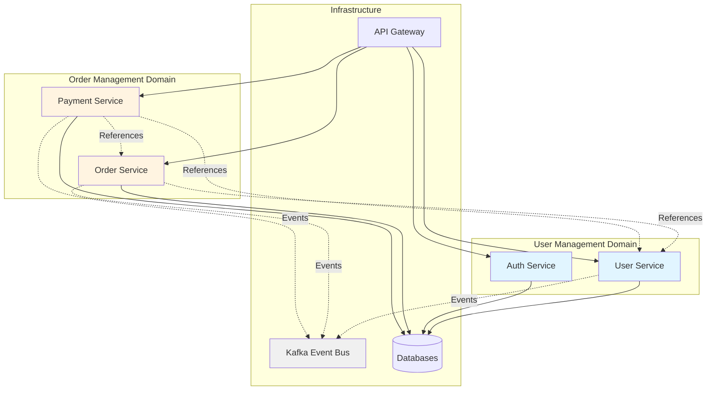
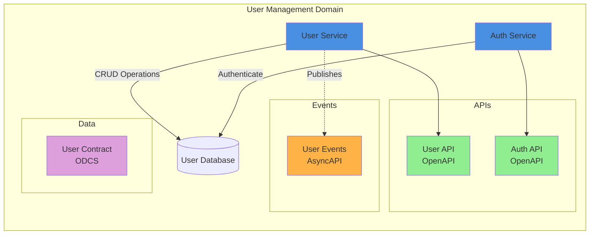
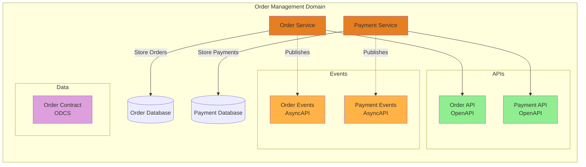
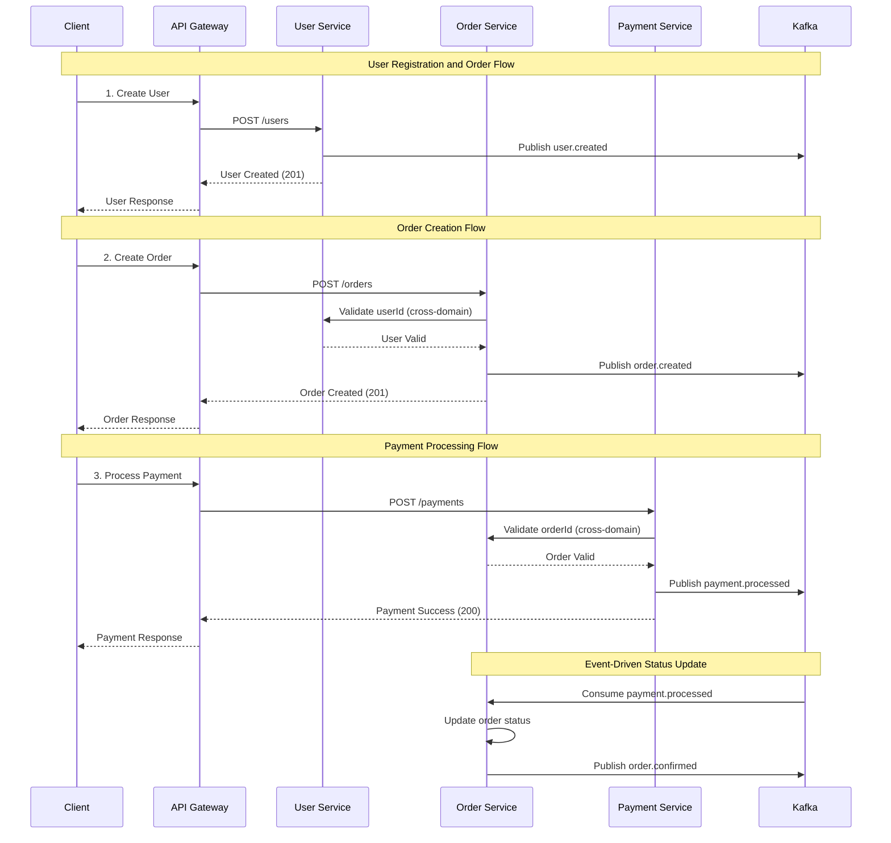
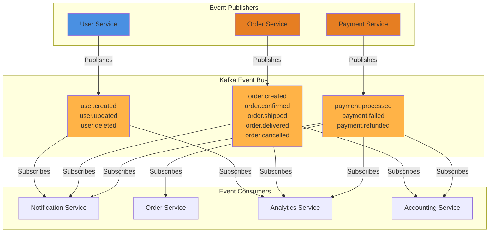
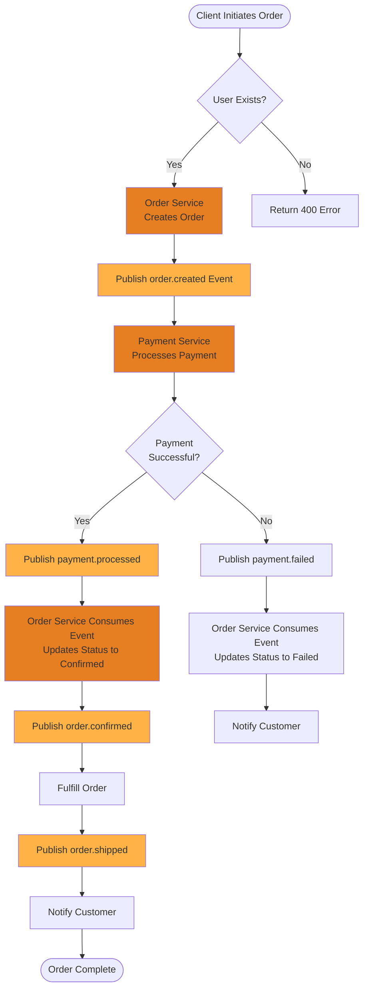
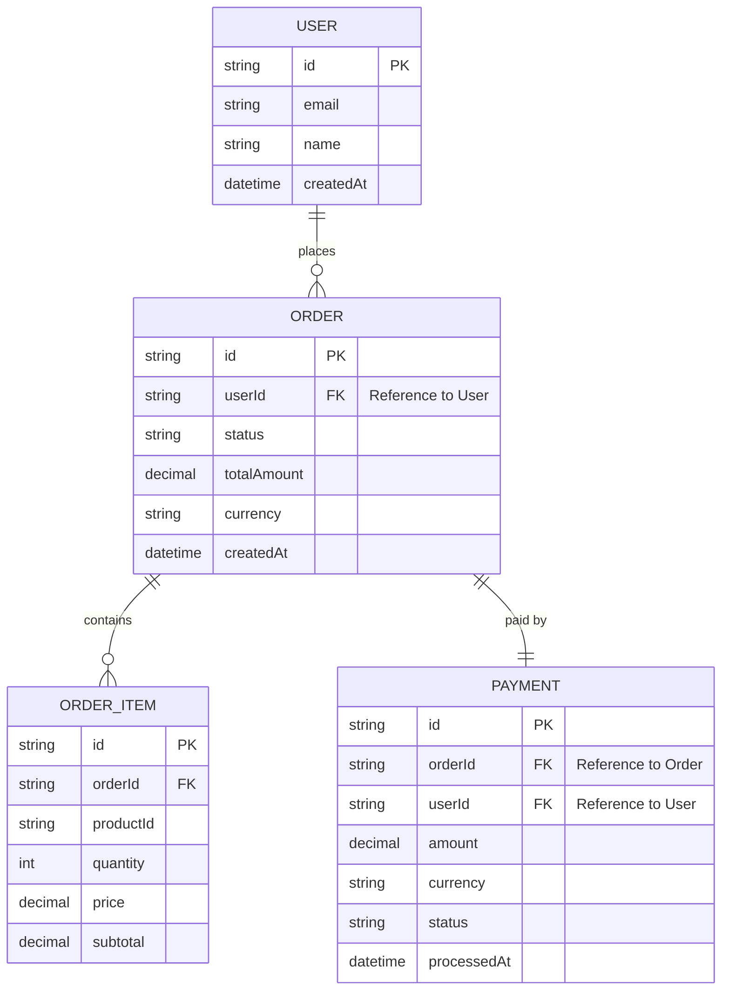
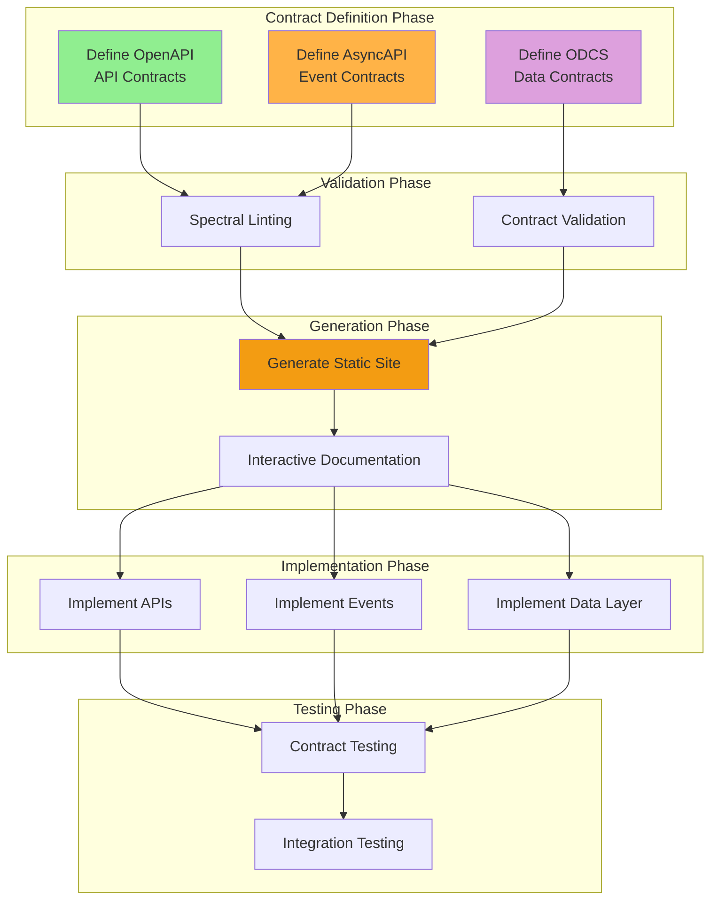
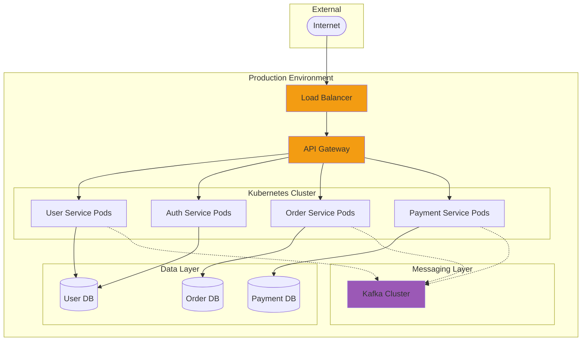

# Architecture Overview

This document provides a comprehensive visual representation of the Contract Catalog architecture, including domains, services, and their interactions.

## Table of Contents

- [System Overview](#system-overview)
- [Domain Architecture](#domain-architecture)
- [Service Interactions](#service-interactions)
- [Event-Driven Architecture](#event-driven-architecture)
- [API Integration Patterns](#api-integration-patterns)
- [Data Flow](#data-flow)

## System Overview

The Contract Catalog demonstrates a microservices architecture organized into two primary domains:



### Key Components

- **User Management Domain**: Handles user identity, authentication, and user data
- **Order Management Domain**: Manages order processing, payments, and fulfillment
- **Event Bus**: Enables asynchronous communication between services via Kafka
- **API Gateway**: Centralized entry point for all client requests

## Domain Architecture

### User Management Domain

The User Management domain provides user identity and authentication services.



**Services:**
- **User Service**: Manages user profiles, registration, and user data
- **Auth Service**: Handles authentication, authorization, and session management

**Contracts:**
- `user-api.yaml` - REST API for user CRUD operations
- `auth-api.yaml` - REST API for authentication
- `user-events.yaml` - User lifecycle events (created, updated, deleted)
- `user-contract.yaml` - User data schema and quality rules

### Order Management Domain

The Order Management domain handles order processing and payment transactions.



**Services:**
- **Order Service**: Manages order lifecycle, inventory, and fulfillment
- **Payment Service**: Processes payments, refunds, and payment reconciliation

**Contracts:**
- `order-api.yaml` - REST API for order management
- `payment-api.yaml` - REST API for payment processing
- `order-events.yaml` - Order lifecycle events (created, confirmed, shipped, etc.)
- `payment-events.yaml` - Payment events (processed, failed, refunded)
- `order-contract.yaml` - Order data schema and quality rules

## Service Interactions

### Cross-Domain Service Communication



### Key Integration Points

1. **Synchronous API Calls**: Services validate cross-domain references via REST APIs
2. **Asynchronous Events**: State changes are communicated via Kafka events
3. **Data References**: Services reference entities from other domains (e.g., userId, orderId)

## Event-Driven Architecture

### Event Flow Diagram



### Event Catalog

#### User Management Events
- **user.created** - Published when a new user registers
- **user.updated** - Published when user profile is modified
- **user.deleted** - Published when user account is removed

#### Order Management Events
- **order.created** - Published when a new order is placed
- **order.confirmed** - Published when payment is confirmed
- **order.shipped** - Published when order is dispatched
- **order.delivered** - Published when order reaches customer
- **order.cancelled** - Published when order is cancelled

#### Payment Events
- **payment.processed** - Published when payment succeeds
- **payment.failed** - Published when payment fails
- **payment.refunded** - Published when payment is refunded

## API Integration Patterns

### REST API Communication Pattern

```mermaid
graph LR
    subgraph "Client Applications"
        WEB[Web App]
        MOBILE[Mobile App]
        PARTNER[Partner API]
    end
    
    subgraph "API Layer"
        GW[API Gateway]
    end
    
    subgraph "Service Layer"
        US[User Service<br/>user-api.yaml]
        AS[Auth Service<br/>auth-api.yaml]
        OS[Order Service<br/>order-api.yaml]
        PS[Payment Service<br/>payment-api.yaml]
    end
    
    WEB --> GW
    MOBILE --> GW
    PARTNER --> GW
    
    GW --> US
    GW --> AS
    GW --> OS
    GW --> PS
    
    OS -.->|GET /users/{id}| US
    PS -.->|GET /orders/{id}| OS
    PS -.->|GET /users/{id}| US
    
    style GW fill:#f39c12
    style US fill:#4a90e2
    style AS fill:#4a90e2
    style OS fill:#e67e22
    style PS fill:#e67e22
```

### Contract Types by Service

| Service | OpenAPI | AsyncAPI | ODCS Data Contract |
|---------|---------|----------|-------------------|
| User Service | ✅ user-api.yaml | ✅ user-events.yaml | ✅ user-contract.yaml |
| Auth Service | ✅ auth-api.yaml | ❌ | ❌ |
| Order Service | ✅ order-api.yaml | ✅ order-events.yaml | ✅ order-contract.yaml |
| Payment Service | ✅ payment-api.yaml | ✅ payment-events.yaml | ❌ |

## Data Flow

### Order Processing Data Flow



### Cross-Domain Data References



**Cross-Domain References:**
- Orders reference Users via `userId` (User Management → Order Management)
- Payments reference both Orders via `orderId` and Users via `userId`
- Events carry cross-domain identifiers for event consumers

## Contract-Driven Development

### Contract Catalog Approach



### Benefits

1. **Design First**: Contracts are defined before implementation
2. **Documentation**: Automatically generated, always up-to-date
3. **Validation**: Contracts are validated before deployment
4. **Collaboration**: Teams can work independently using contracts
5. **Testing**: Contract tests ensure compatibility

## Deployment Architecture



## Technology Stack

### Service Technologies
- **Programming Languages**: Node.js (TypeScript), Python, Go (varies by service)
- **API Framework**: Express.js, FastAPI, Gin
- **Documentation**: Contract Catalog (OpenAPI, AsyncAPI, ODCS)

### Infrastructure
- **Container Orchestration**: Kubernetes
- **Message Broker**: Apache Kafka
- **Databases**: PostgreSQL (transactional), MongoDB (document store)
- **API Gateway**: Kong, AWS API Gateway
- **Service Mesh**: Istio (optional)

### Contract Tools
- **Contract Catalog**: This repository - static site generator
- **OpenAPI**: Redoc for interactive API documentation
- **AsyncAPI**: AsyncAPI Generator with HTML template
- **ODCS**: datacontract-cli for data contract rendering
- **Validation**: Spectral for contract linting

## Next Steps

To extend this architecture:

1. **Add New Domains**: Create new domain directories under `contracts/`
2. **Add New Services**: Create service directories within domains
3. **Define Contracts**: Add OpenAPI, AsyncAPI, and ODCS contracts
4. **Update Architecture**: Update this document with new domains/services
5. **Generate Docs**: Run `npm run generate` to update documentation

## Resources

- [Main README](README.md) - Quick start and usage guide
- [OpenAPI Specification](https://swagger.io/specification/)
- [AsyncAPI Specification](https://www.asyncapi.com/docs/reference/specification/v2.6.0)
- [Open Data Contract Standard](https://github.com/bitol-io/open-data-contract-standard)
- [Contract Catalog Generator](src/generators/site-generator.ts)
