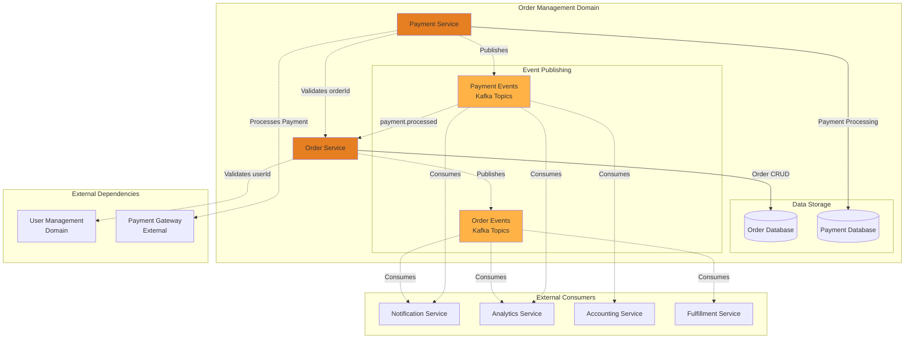
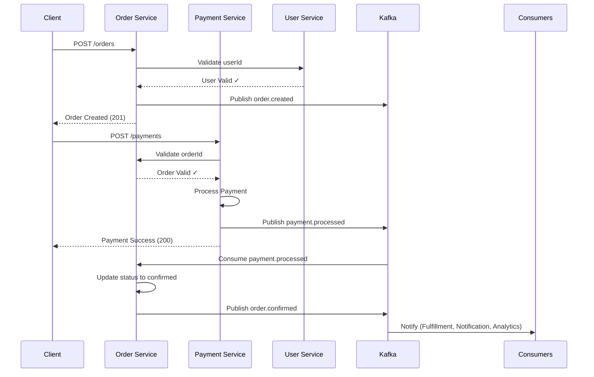
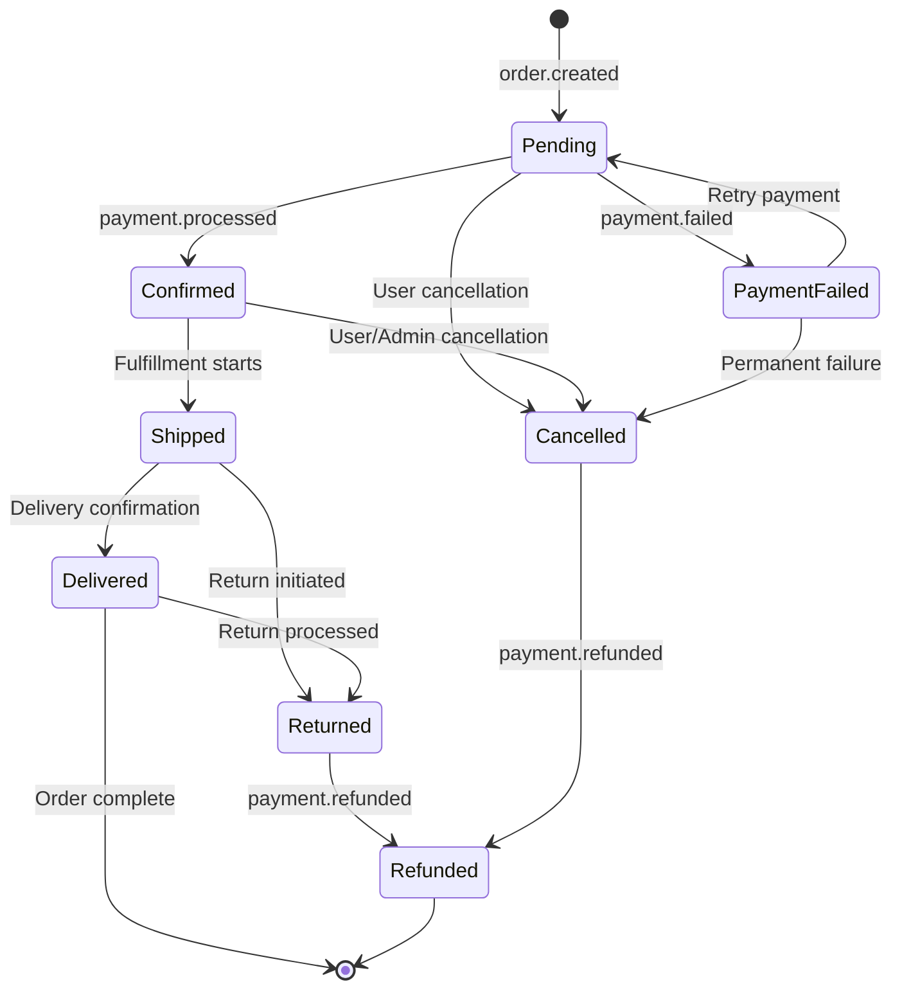

# Order Management Domain

## Overview

The Order Management domain handles the complete order lifecycle from creation to fulfillment, including payment processing. It orchestrates cross-domain interactions with User Management and publishes events for downstream consumers.

## Domain Architecture



## Services

### Order Service

**Purpose**: Manages the complete order lifecycle from creation to delivery.

**Responsibilities**:
- Order creation and validation
- Order status management (pending → confirmed → shipped → delivered)
- Order item management
- Inventory coordination
- Cross-domain user validation
- Publishing order lifecycle events
- Responding to payment events

**Contracts**:
- [order-api.yaml](order-service/order-api.yaml) - OpenAPI 3.0 REST API specification
- [order-events.yaml](order-service/order-events.yaml) - AsyncAPI 2.6 event specification
- [order-contract.yaml](order-service/order-contract.yaml) - ODCS v3.1.0 data contract

**Key Endpoints**:
- `GET /orders` - List orders (filterable by userId, status)
- `POST /orders` - Create a new order
- `GET /orders/{orderId}` - Get order details
- `PATCH /orders/{orderId}` - Update order status
- `GET /orders/{orderId}/items` - Get order items

**Events Published**:
- `order.created` - When a new order is placed
- `order.confirmed` - When payment is confirmed
- `order.shipped` - When order is dispatched
- `order.delivered` - When order reaches customer
- `order.cancelled` - When order is cancelled

**Events Consumed**:
- `payment.processed` - Updates order status to confirmed
- `payment.failed` - Updates order status to payment_failed
- `payment.refunded` - Updates order status to refunded

### Payment Service

**Purpose**: Processes payments, refunds, and payment reconciliation.

**Responsibilities**:
- Payment authorization and capture
- Payment method management
- Refund processing
- Payment reconciliation
- Integration with external payment gateways
- Cross-domain validation (order and user)
- Publishing payment events

**Contracts**:
- [payment-api.yaml](payment-service/payment-api.yaml) - OpenAPI 3.0 REST API specification
- [payment-events.yaml](payment-service/payment-events.yaml) - AsyncAPI 2.6 event specification

**Key Endpoints**:
- `POST /payments` - Process a payment
- `GET /payments/{paymentId}` - Get payment details
- `POST /payments/{paymentId}/refund` - Issue a refund
- `GET /payments/order/{orderId}` - Get payments for an order

**Events Published**:
- `payment.processed` - When payment succeeds
- `payment.failed` - When payment fails
- `payment.refunded` - When payment is refunded

## Cross-Domain Integration

### Inbound Dependencies
This domain **depends on**:
- **User Management**: Validates `userId` when creating orders
  - Calls `GET /users/{userId}` to verify user exists
  - References user data in order and payment entities

### Outbound Provides
This domain **provides**:
- Order data to payment processing (`orderId` in payments)
- Order and payment events to downstream services

### Event-Driven Integration



## Data Models

### Order Entity

```yaml
Order:
  properties:
    id: string (UUID)           # Primary key
    userId: string (UUID)       # FK to User Management domain
    status: enum                # pending, confirmed, shipped, delivered, cancelled
    totalAmount: decimal        # Total order amount
    currency: string            # Currency code (USD, EUR, etc.)
    items: array                # Array of OrderItem objects
    shippingAddress: object     # Delivery address
    billingAddress: object      # Billing address
    createdAt: timestamp        # Order creation time
    updatedAt: timestamp        # Last update time
```

### Order Item Entity

```yaml
OrderItem:
  properties:
    id: string (UUID)           # Primary key
    orderId: string (UUID)      # FK to Order
    productId: string           # Product identifier
    productName: string         # Product name
    quantity: integer           # Quantity ordered
    price: decimal              # Price per unit
    subtotal: decimal           # quantity * price
```

### Payment Entity

```yaml
Payment:
  properties:
    id: string (UUID)           # Primary key
    orderId: string (UUID)      # FK to Order Management domain
    userId: string (UUID)       # FK to User Management domain
    amount: decimal             # Payment amount
    currency: string            # Currency code
    paymentMethod: string       # Credit card, PayPal, etc.
    status: enum                # pending, processed, failed, refunded
    transactionId: string       # External payment gateway transaction ID
    processedAt: timestamp      # Processing timestamp
    failureReason: string       # Reason if failed (optional)
```

### Data Quality Rules

As defined in [order-contract.yaml](order-service/order-contract.yaml):
- Order ID cannot be null
- Order must reference valid userId
- Total amount must be > 0
- Order items array must contain at least 1 item
- Order status must follow valid state transitions
- Data freshness: updated within 24 hours

## Event Schemas

### order.created

```json
{
  "orderId": "uuid",
  "userId": "uuid",
  "status": "pending",
  "totalAmount": 99.99,
  "currency": "USD",
  "itemCount": 3,
  "createdAt": "2024-01-31T10:00:00Z"
}
```

### order.confirmed

```json
{
  "orderId": "uuid",
  "userId": "uuid",
  "status": "confirmed",
  "paymentId": "uuid",
  "confirmedAt": "2024-01-31T10:05:00Z"
}
```

### payment.processed

```json
{
  "paymentId": "uuid",
  "orderId": "uuid",
  "userId": "uuid",
  "amount": 99.99,
  "currency": "USD",
  "paymentMethod": "credit_card",
  "transactionId": "ext-12345",
  "processedAt": "2024-01-31T10:05:00Z"
}
```

### payment.failed

```json
{
  "paymentId": "uuid",
  "orderId": "uuid",
  "userId": "uuid",
  "amount": 99.99,
  "currency": "USD",
  "failureReason": "Insufficient funds",
  "failureCode": "INSUFFICIENT_FUNDS",
  "failedAt": "2024-01-31T10:05:00Z"
}
```

## Order State Machine



## Business Rules

### Order Creation
1. User must exist (validated via User Management API)
2. Order must contain at least 1 item
3. All product IDs must be valid
4. Total amount must be > 0
5. Shipping address is required for physical products

### Payment Processing
1. Order must exist and be in valid state (pending, payment_failed)
2. Payment amount must match order total
3. User must match order's userId
4. Payment method must be valid and active
5. Duplicate payments prevented by idempotency

### Order Status Transitions
- `pending` → `confirmed` (payment succeeds)
- `confirmed` → `shipped` (fulfillment starts)
- `shipped` → `delivered` (delivery confirmed)
- Any pre-shipped state → `cancelled` (user/admin action)
- `delivered` → `returned` (return initiated)

## Security

### Authorization
- Users can only access their own orders
- Admins can access all orders
- Payment details masked for non-authorized access

### Data Protection
- Payment details encrypted at rest
- PCI-DSS compliance for payment data
- Audit logs for all payment transactions
- Secure communication with payment gateways

### Idempotency
- Duplicate order prevention using client-provided idempotency keys
- Duplicate payment prevention using transaction IDs

## SLA & Support

### Service Level Agreement
- **Availability**: 99.95% uptime
- **Order Creation**: < 300ms (p95)
- **Payment Processing**: < 2s (p95)
- **Event Delivery**: < 5s (p99)
- **Data Freshness**: Real-time updates

### Support Channels
- **Email**: orders@example.com
- **Slack**: #order-management-support
- **On-Call**: 24/7 for payment issues

## Integration Examples

### Create Order Flow

```bash
# 1. Validate user exists (cross-domain call)
GET /users/{userId}

# 2. Create order
POST /orders
{
  "userId": "user-uuid",
  "items": [
    {
      "productId": "prod-123",
      "quantity": 2,
      "price": 49.99
    }
  ],
  "currency": "USD"
}

# 3. Event published: order.created

# 4. Process payment
POST /payments
{
  "orderId": "order-uuid",
  "amount": 99.98,
  "paymentMethod": "credit_card",
  "cardToken": "tok_xxxx"
}

# 5. Events published: payment.processed, order.confirmed
```

## Development

### Local Setup

```bash
# Navigate to order management contracts
cd contracts/order-management

# Validate contracts
npm run lint

# View in Contract Catalog
npm run generate
npm run serve
```

### Testing

```bash
# Validate OpenAPI contracts
npx spectral lint order-service/order-api.yaml
npx spectral lint payment-service/payment-api.yaml

# Validate AsyncAPI contracts
npx spectral lint order-service/order-events.yaml
npx spectral lint payment-service/payment-events.yaml

# Validate Data Contract
datacontract lint order-service/order-contract.yaml
```

## Metrics & Monitoring

### Key Metrics
- Order creation rate
- Order completion rate
- Average order value
- Payment success/failure rate
- Order status distribution
- Time to fulfillment

### Alerts
- Payment failure rate > 2%
- Order creation latency > 500ms
- Event publishing failures
- Database connection issues
- Cross-domain API call failures

## Future Enhancements

- [ ] Add inventory management integration
- [ ] Implement split payments
- [ ] Add subscription/recurring orders
- [ ] Enhanced fraud detection
- [ ] Real-time order tracking
- [ ] Returns and exchanges API
- [ ] Multi-currency support improvements

## Related Documentation

- [System Architecture Overview](../../ARCHITECTURE.md)
- [User Management Domain](../user-management/README.md)
- [API Documentation](http://localhost:8080/order-management) (after running `npm run serve`)
