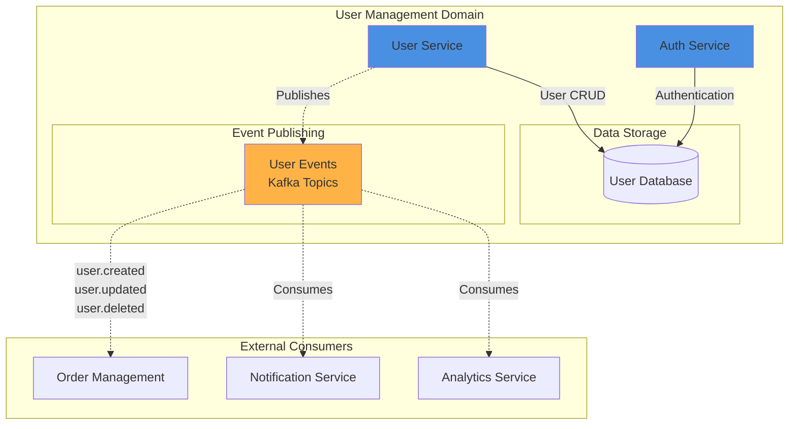

# User Management Domain

## Overview

The User Management domain provides core identity and authentication services for the entire system. It manages user profiles, authentication, and authorization across all domains.

## Domain Architecture



## Services

### User Service

**Purpose**: Manages user profiles, registration, and user data lifecycle.

**Responsibilities**:
- User registration and profile creation
- User profile updates and deletion
- User data retrieval and listing
- Publishing user lifecycle events
- Maintaining user data quality standards

**Contracts**:
- [user-api.yaml](user-service/user-api.yaml) - OpenAPI 3.0 REST API specification
- [user-events.yaml](user-service/user-events.yaml) - AsyncAPI 2.6 event specification
- [user-contract.yaml](user-service/user-contract.yaml) - ODCS v3.1.0 data contract

**Key Endpoints**:
- `GET /users` - List all users
- `POST /users` - Create a new user
- `GET /users/{userId}` - Get user by ID
- `PUT /users/{userId}` - Update user
- `DELETE /users/{userId}` - Delete user

**Events Published**:
- `user.created` - When a new user registers
- `user.updated` - When user profile is modified
- `user.deleted` - When user account is removed

### Auth Service

**Purpose**: Handles authentication, authorization, and session management.

**Responsibilities**:
- User authentication (login/logout)
- Token generation and validation (JWT)
- Session management
- Password reset and recovery
- Multi-factor authentication (MFA)

**Contracts**:
- [auth-api.yaml](auth-service/auth-api.yaml) - OpenAPI 3.0 REST API specification

**Key Endpoints**:
- `POST /auth/login` - Authenticate user
- `POST /auth/logout` - End user session
- `POST /auth/refresh` - Refresh authentication token
- `POST /auth/reset-password` - Initiate password reset
- `GET /auth/validate` - Validate token

## Cross-Domain Integration

### Outbound References
This domain **provides** user identity to other domains:
- Order Management domain references `userId` in orders
- Payment Service references `userId` in payments

### Consumed By
User Management events are consumed by:
- **Order Service**: Validates user existence when creating orders
- **Notification Service**: Sends welcome emails on user.created
- **Analytics Service**: Tracks user growth and engagement

## Data Model

### User Entity

```yaml
User:
  properties:
    id: string (UUID)           # Primary key
    email: string (email)       # Unique, required
    name: string                # Required
    phone: string               # Optional
    address: object             # Optional shipping address
    preferences: object         # User preferences
    status: enum                # active, inactive, suspended
    createdAt: timestamp        # Auto-generated
    updatedAt: timestamp        # Auto-updated
```

### Data Quality Rules

As defined in [user-contract.yaml](user-service/user-contract.yaml):
- Email must be unique and valid format
- User ID cannot be null
- User data must be updated within 24 hours (freshness)
- Minimum of 0 records in user table (completeness)
- Data retention: 7 years

## Event Schema

### user.created

```json
{
  "userId": "uuid",
  "email": "user@example.com",
  "name": "John Doe",
  "createdAt": "2024-01-31T10:00:00Z"
}
```

### user.updated

```json
{
  "userId": "uuid",
  "email": "user@example.com",
  "name": "John Doe Updated",
  "updatedFields": ["name", "phone"],
  "updatedAt": "2024-01-31T11:00:00Z"
}
```

### user.deleted

```json
{
  "userId": "uuid",
  "email": "user@example.com",
  "deletedAt": "2024-01-31T12:00:00Z",
  "reason": "user request"
}
```

## Security

### Authentication
- JWT-based authentication with short-lived tokens
- Refresh tokens for extended sessions
- MFA support for enhanced security

### Authorization
- Role-based access control (RBAC)
- Defined roles: admin, customer, support

### Data Protection
- Passwords hashed with bcrypt
- Personal data encrypted at rest
- GDPR compliance for data deletion
- PII data masked in logs

## SLA & Support

### Service Level Agreement
- **Availability**: 99.9% uptime
- **Response Time**: < 200ms (p95)
- **Data Freshness**: Updates within 24 hours
- **Retention**: 7 years

### Support Channels
- **Email**: user-team@example.com
- **Slack**: #user-management-support
- **On-Call**: Available 24/7 for critical issues

## Development

### Local Setup

```bash
# Navigate to user management contracts
cd contracts/user-management

# Validate contracts
npm run lint

# View in Contract Catalog
npm run generate
npm run serve
```

### Testing

```bash
# Validate OpenAPI contracts
npx spectral lint user-service/user-api.yaml
npx spectral lint auth-service/auth-api.yaml

# Validate AsyncAPI contracts
npx spectral lint user-service/user-events.yaml

# Validate Data Contract
datacontract lint user-service/user-contract.yaml
```

## Metrics & Monitoring

### Key Metrics
- User registration rate
- Active user count
- Authentication success/failure rate
- API response times
- Event publish rate

### Alerts
- Authentication failure rate > 5%
- API response time > 500ms
- Database connection failures
- Event publishing failures

## Future Enhancements

- [ ] Add social authentication (OAuth2)
- [ ] Implement user segmentation
- [ ] Add user preferences management API
- [ ] Enhance MFA with biometric options
- [ ] Add user activity tracking events

## Related Documentation

- [System Architecture Overview](../../ARCHITECTURE.md)
- [Order Management Domain](../order-management/README.md)
- [API Documentation](http://localhost:8080/user-management) (after running `npm run serve`)
